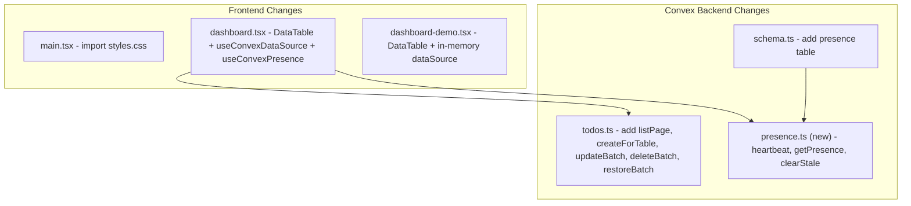

# Integrate @talentum-ventures/convex-datatable

## Current State

The project has two dashboard views that render todos as card-style rows using local `useState`:

- [client/src/components/dashboard.tsx](client/src/components/dashboard.tsx) (Convex-authenticated mode)
- [client/src/components/dashboard-demo.tsx](client/src/components/dashboard-demo.tsx) (demo mode, no Convex)

Neither dashboard connects to the Convex backend, and neither uses a datatable. The Convex backend ([convex/todos.ts](convex/todos.ts)) has full CRUD but no paginated query.

## Changes Overview



## 1. Install the library

```bash
npm install @talentum-ventures/convex-datatable
```

## 2. Import datatable CSS

In [client/src/main.tsx](client/src/main.tsx), add at top:

```ts
import '@talentum-ventures/convex-datatable/styles.css';
```

## 3. Update Convex schema

In [convex/schema.ts](convex/schema.ts), add the `presence` table using `presenceFields` from the library's server export:

```ts
import { presenceFields } from "@talentum-ventures/convex-datatable/convex-server";

// Add to defineSchema:
presence: defineTable(presenceFields),
```

## 4. Add Convex backend functions

### [convex/todos.ts](convex/todos.ts) - Add new functions

- `listPage` - Paginated query using `paginationOptsValidator` for the datatable's `usePageQuery` pattern
- `createForTable` - Mutation that accepts draft fields and returns the full document (not just the ID)
- `updateBatch` - Mutation accepting `changes: [{ rowId, patch }]` for batch cell edits
- `deleteBatch` - Mutation accepting `rowIds: string[]` for batch deletion
- `restoreBatch` - Mutation accepting full row objects to re-insert (for undo-delete)

Keep existing functions (`list`, `get`, `create`, `update`, `remove`, `toggleComplete`) untouched for backward compatibility.

### [convex/presence.ts](convex/presence.ts) (new file)

Create using the library's server helpers:

```ts
import {
  heartbeatHandler,
  getPresenceHandler,
  clearStalePresenceHandler,
} from '@talentum-ventures/convex-datatable/convex-server';

export const heartbeat = mutation(heartbeatHandler('presence'));
export const getPresence = query(getPresenceHandler('presence'));
export const clearStale = mutation(clearStalePresenceHandler('presence'));
```

## 5. Rewrite Dashboard (Convex mode)

Rewrite [client/src/components/dashboard.tsx](client/src/components/dashboard.tsx):

- Remove: local `useState` for todos, card-based todo rendering, manual add/toggle/delete handlers, related imports (Input, Select, Badge, Checkbox, etc.)
- Add: `DataTable` + `DataTableContainer` from the library, `useConvexDataSource` + `useConvexPresence` from the Convex adapter
- Use `useQuery`/`useMutation` from `convex/react` for the adapter hooks
- Keep: header with user menu/sign-out, ThemeToggle, footer

**Column definitions:**

- `title` (text, editable)
- `description` (longText, editable)
- `priority` (select, editable) with low/medium/high options and colored badges
- `dueDate` (date, editable)
- `createdAt` (date, read-only)

**Row actions:** "Toggle Complete" action using the existing `toggleComplete` mutation.

**Features enabled:** `editing`, `rowAdd`, `rowDelete`, `undo`.

**Presence:** Wire up `useConvexPresence` with the current user's info, pass `collaborators` and `onActiveCellChange` to DataTable.

## 6. Rewrite Dashboard Demo (no-Convex mode)

Rewrite [client/src/components/dashboard-demo.tsx](client/src/components/dashboard-demo.tsx):

- Remove: same old code as dashboard.tsx
- Add: `DataTable` + `DataTableContainer` with a simple in-memory `DataTableDataSource` using hardcoded sample todos
- No Convex adapter (demo mode has no Convex connection)
- Same column definitions as the Convex dashboard
- Keep: header with back button, ThemeToggle, footer

## 7. No files to delete

The shadcn/ui `table.tsx` and `pagination.tsx` are generic UI primitives unrelated to the old todo implementation -- keep them for potential future use.
